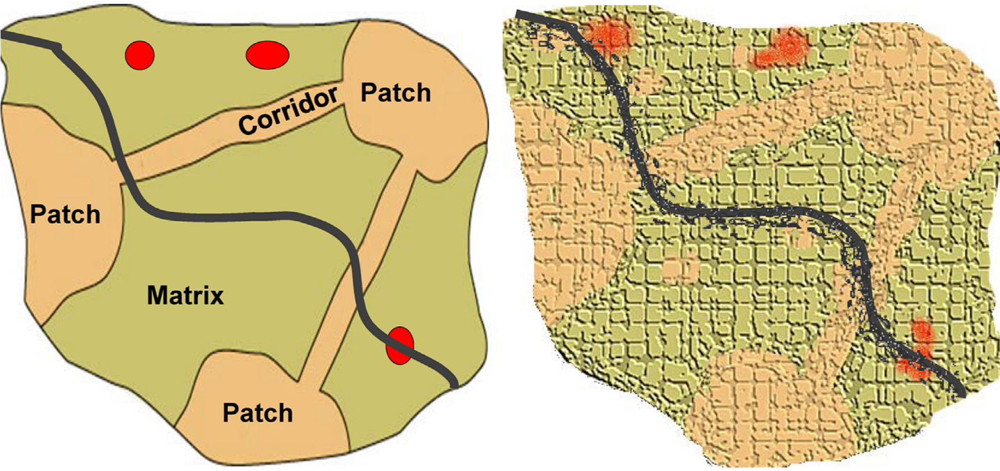
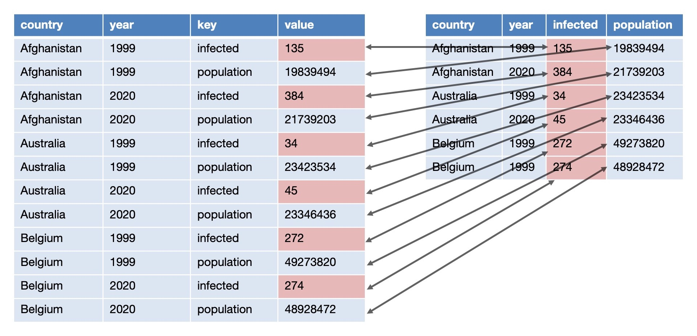
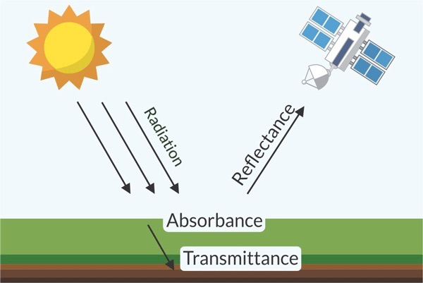
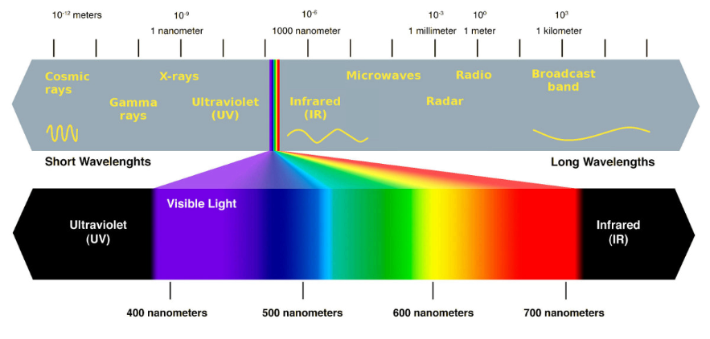
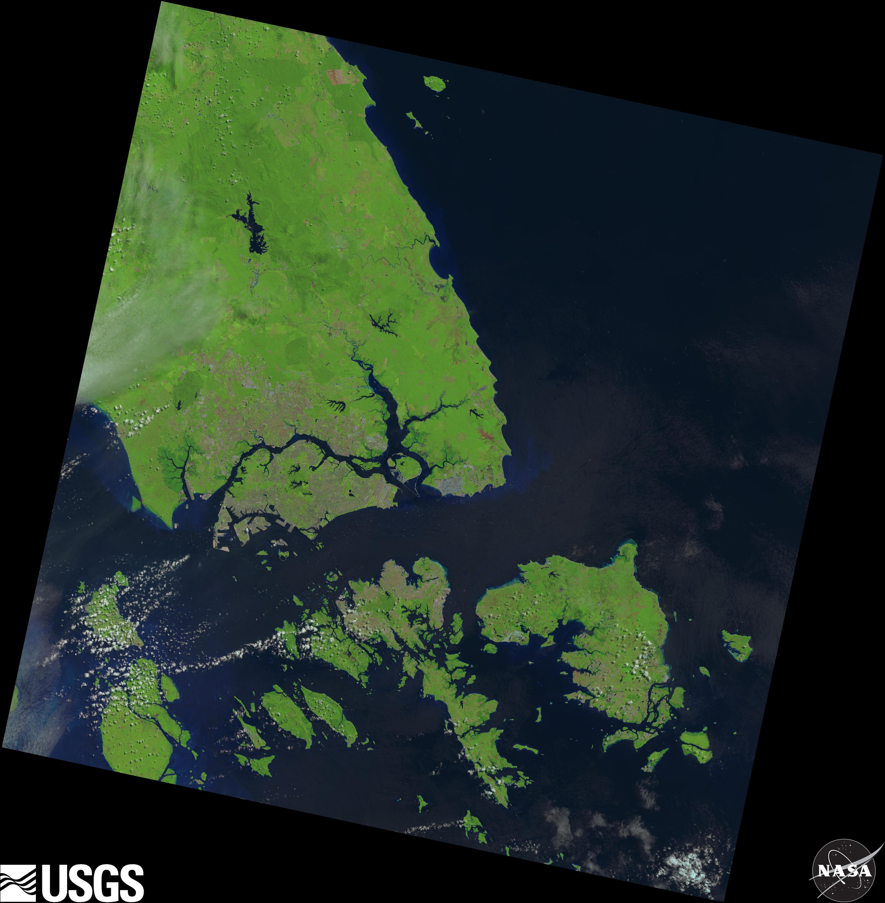

class: inverse, center, middle

```{r export slides to pdf, include = FALSE, eval = FALSE}
pagedown::chrome_print('https://github.com/xp-song/Intro2R-spatial/slides/1_Intro2R-spatial_slides.html')
```


# Before we begin...

1. Navigate to course webpage and read background information  
*https://github.com/xp-song/Intro2R-spatial*  

2. [Download](https://github.com/xp-song/Intro2R-spatial/archive/master.zip) workshop materials  
*(green button on webpage)*

---

class: inverse, center, middle
name: why

# Outline  
 
__[Why analyse spatial patterns?](#why)__  

[Landscape ecology: Conceptual models](#concepts)

[Land cover classification](#classify)  

[Landscape metrics](#lsm)  

[Useful resources](#resources)  

---
class: left
background-image: url("images/sg_urech2017.jpg")
background-position: center
background-size: cover

# Spatial pattern of a landscape

### A function of the *__composition__* and *configuration* of the physical landscape

???
- What is this landscape composed of?

---
class: left
background-image: url("images/sg_urech2017.jpg")
background-position: center
background-size: cover

# Spatial pattern of a landscape

### **Spatial composition**
- Variety - What types/classes?
- Abundance - How much?

???
- E.g. Classify as green, blue, grey
- Absolute (i.e. total area) or relative (%) abundance

---

class: left
background-image: url("images/sg_urech2017.jpg")
background-position: center
background-size: cover

# Spatial pattern of a landscape

### A function of the *composition* and *__configuration__* of the physical landscape

???
- Quantifying this is more complex

---
class: left
background-image: url("images/sg_urech2017.jpg")
background-position: center
background-size: cover

# Spatial pattern of a landscape

### **Spatial configuration**
- Position
- Orientation
- Shape/arrangement

???
What if...
1. Plants on the left... buildings/roads were on the right?
2. Greenery at the waterfront... urban cover was inland?
3. Greenery finely interspersed with the grey cover?


- Configuration -> The idea of "connectectivity" becomes relevant

---

class: left

# Why is spatial pattern important?

### The study of landscape ecology  

<sup> </sup>

```{r diagram, echo = FALSE, fig.align = "center"}
library(DiagrammeR)
m <- mermaid("graph LR;
		   A(Spatial Patterns) --> B(Ecological Processes);
		   B(Ecological Processes)--> A(Spatial Patterns);
		   B(Ecological Processes) --> C(City Sustainability & Resilience);
		   C(City Sustainability & Resilience) --> D(Human Well-being);
		   ")
widgetframe::frameWidget(m, height = 230, width = '100%')
```

.right[.small[*Figure adopted from Wu et al. (2015)*]]

???
- One area of study tt is highly relevant...
- Spatial pattern reflects underlying ecological processes & vice versa (reciprocal effect)
- What are some examples of pattern-process relationships? 
  - Topography & hydrological processes
  - Plants & carbon storage

---

class: left

# Why is spatial pattern important?

### The study of landscape ecology  

<sup> </sup>

```{r echo = FALSE, fig.align = "center"}
library(DiagrammeR)
m <- mermaid("graph LR;
		   A(Spatial Patterns) --> B(Ecological Processes);
		   B(Ecological Processes)--> A(Spatial Patterns);
		   B(Ecological Processes) --> C(City Sustainability & Resilience);
		   C(City Sustainability & Resilience) --> D(Human Well-being);
		   ")
widgetframe::frameWidget(m, height = 230, width = '100%')
```

.right[.small[*Figure adopted from Wu et al. (2015)*]]

__Pattern-process relationships__  
  
- How do we optimise spatial *patterns* to achieve desired ecological *processes*?  
- How can we incorporate such thinking into policy & design?  

???
- Some questions...

---

class: inverse, center, middle
name: concepts

# Outline  
 
[Why analyse spatial patterns?](#why)  

__[Landscape ecology: Conceptual models](#concepts)__

[Land cover classification](#classify)  

[Landscape metrics](#lsm)  

[Useful resources](#resources)  

---

class: center
background-image: url("images/sg_urech2017.jpg")
background-position: center
background-size: cover

# Landscape ecology: Conceptual models

__Mosaic model vs. Gradient model__  


???
- Previously, we talked about green/grey cover
- Characterised the landscape into discrete classes (Mosaic)
- But... Canopy above road.... Where does the forest end? Are we oversimplifying...?
- Soft edges between classes (Gradient)?

---

class: center

# Landscape ecology: Conceptual models

.right[.small[*Figure from Lausch et al. (2015)*]]

```{r eval = TRUE, echo = FALSE, out.width=700, fig.align='center'}

```

.pull-left[__PCM (mosaic) model__]
.pull-right[__Gradient model__]

???
- PCM: Patch Corridor Matrix
- Note: Both images can be in raster format!

---

class: inverse, center, middle
name: classify

# Outline  
 
[Why analyse spatial patterns?](#why)  

[Landscape ecology: Conceptual models](#concepts)

__[Land cover classification](#classify)__  

[Landscape metrics](#lsm)  

[Useful resources](#resources)  

???
- In our workshop: Classify landscape into discrete land cover classes (mosaic model)

---

class: inverse, left, center, middle

# Time to boot up R!

1. Navigate to downloaded [workshop materials](https://github.com/xp-song/Intro2R-spatial/archive/master.zip) on your computer  

2. Open Rstudio project __Intro2R-spatial.Rproj__  

3. Create new R notebook in parent directory    


---

class: left

# Before we begin...

### Install packages

- [tidyverse](https://www.tidyverse.org/packages/): A collection of packages commonly used for data analyses  
- [raster](https://www.rdocumentation.org/packages/raster/versions/3.0-7): Analyse raster data
- [sf](https://r-spatial.github.io/sf/articles/sf2.html): Analyse spatial data in a "tidy" workflow (a.k.a. "simple features")   
- [landscapemetrics](https://r-spatialecology.github.io/landscapemetrics/index.html): Analyse spatial patterns of discrete landscape classes in a "tidy" workflow  

???

- All packages share a common design philosophy - how code is written... how data is structured
- Designed to make workflows consistent & reproucible... & hopefully improve productivity

--

```{r eval = FALSE}
# don't forget quotes
install.packages("tidyverse") 
install.packages("raster")
install.packages("sf")
install.packages("landscapemetrics")
```

.small[Enter `n` if you get the following prompt:  
`Do you want to install from sources the package which needs compilation?`]

---

class: left

# Before we begin...

## What is "tidy" data?

- Tabular data (2D)  
- Each variable is a column & each observation is a row  

```{r eval = TRUE, echo = FALSE, out.width=700, fig.align='center'}

```

???
- Which is tidy? Right
- Observation in year X: X infected out of total population X

---

class: left

# Land cover classification

.left-column[ 
### Images
]
.right-column[ 
__Possible data sources:__  

- Remotely sensed data (i.e. satellites, drones, planes)
- Historical maps
- Field surveys
] 

--

.right-column[ 
We will be using freely available [Landsat](https://landsat.gsfc.nasa.gov/a-landsat-timeline/) satellite images from the public database https://earthexplorer.usgs.gov/
.small[
- Sign up for an account
- Specify search criteria (i.e. location & date range)
- Specify dataset (Landsat > Landsat Collection 1 Level-1 > Landsat 8 OLI/TIRS C1 Level-1)
- Specify additional criteria (e.g. < 10% cloud cover; Day)
- Order scene and checkout
- Submit Order to download scenes when status is "Processing Complete"
- Install Bulk Download Application (BDA) on your computer
- Login & download ordered scenes
]
] 

???
- OLI: Operational Land Imager
  - Spectral bands to detect clouds & NIR
- TIRS: Thermal Infrared Scanner

---

class: left

# Land cover classification

.left-column[ 
### Images
]
.right-column[ 
__Remotely-sensed data: A brief introduction__  

- Satellites have multiple sensors that measure surface _reflectance_ 

```{r eval = TRUE, echo = FALSE, out.width=500, fig.align='center'}

```

.right[.small[Figure by Luciana Nieto and Ignacio Ciampitti, K-State Research and Extension]]
] 

---

class: left

# Land cover classification

.left-column[ 
### Images
]
.right-column[ 
__Remotely-sensed data: A brief introduction__  

- Satellites have multiple sensors that measure surface _reflectance_ 
- Sensors measure specific range of wavelengths along the electromagnetic spectrum
- Spatial resolution varies between sensors

```{r eval = TRUE, echo = FALSE, out.width=500, fig.align='center'}

```

.right[.small[Figure from cleanpng.com]]
] 

???
- What we see on Google Earth: RGB bands
- Multispectral images: IR/NIR bands
- Hyperspectral: 100-1000 bands
- Having more bands = classify land cover more accurately

---

class: left

# Land cover classification

.left-column[ 
### Images
]
.right-column[ 
__Remotely-sensed data: A brief introduction__  

- Satellites have multiple sensors that measure surface _reflectance_ 
- Sensors measure specific range of wavelengths along the electromagnetic spectrum
- Spatial resolution varies between sensors
- Data stored as multiple raster layers (images) a.k.a. "scenes" or "bands"
] 

---

class: left

# Land cover classification

.left-column[ 
### Images
]
.right-column[ 
__We're using the Landsat-8 scene of Singapore on 2018/05/24__  
(30m resolution for RGB, NIR & SWIR)  

- Navigate to the *data* folder

```{r eval = TRUE, echo = FALSE, out.width=300, out.height=300, fig.align='center'}

```

.center[.small[Landsat-8 natural color image. Source: U.S. Geological Survey.]]
] 

???
- Contains 3 preview images: Natural color, Thermal infrared, Band quality

---

class: left

# Land cover classification

.left-column[ 
### Images
]
.right-column[ 
__We're using the Landsat-8 scene of Singapore on 2018/05/24__  
(30m resolution for RGB, NIR & SWIR)  

- Navigate to the *data* folder
- Unzip *LC08_L1TP_125059_20180524_20180605_01_T1.zip* to obtain 11 multispectral bands of the same region
] 

???
- Named according to the product identifier (details found online)
- BQA: Band quality assessment (based on cloud cover)
- Ultra Blue, Blue, Green, Red, Near Infrared (NIR), Shortwave Infrared (SWIR) 1, SWIR 2, Panchromatic, Cirrus, Thermal Infrared (TIRS) 1, TIRS 2

---

class: left

# Land cover classification

.left-column[ 
### <span style="color:grey">Images</span>
### Import
]
.right-column[ 
__Let's import the bands into R!__

```{r warning = FALSE, message = FALSE, eval = FALSE}
library(raster)

#blue
b2 <- raster('data/Landsat 8 OLI_TIRS C1 Level-1/LC08_L1TP_125059_20180524_20180605_01_T1/LC08_L1TP_125059_20180524_20180605_01_T1_B2.tif')
#green
b3 <- raster('data/Landsat 8 OLI_TIRS C1 Level-1/LC08_L1TP_125059_20180524_20180605_01_T1/LC08_L1TP_125059_20180524_20180605_01_T1_B3.tif')
#red
b4 <- raster('data/Landsat 8 OLI_TIRS C1 Level-1/LC08_L1TP_125059_20180524_20180605_01_T1/LC08_L1TP_125059_20180524_20180605_01_T1_B4.tif')
```
```{r warning = FALSE, message = FALSE, echo = FALSE}
library(raster)
b2 <- raster('../data/Landsat 8 OLI_TIRS C1 Level-1/LC08_L1TP_125059_20180524_20180605_01_T1/LC08_L1TP_125059_20180524_20180605_01_T1_B2.tif')
b3 <- raster('../data/Landsat 8 OLI_TIRS C1 Level-1/LC08_L1TP_125059_20180524_20180605_01_T1/LC08_L1TP_125059_20180524_20180605_01_T1_B3.tif')
b4 <- raster('../data/Landsat 8 OLI_TIRS C1 Level-1/LC08_L1TP_125059_20180524_20180605_01_T1/LC08_L1TP_125059_20180524_20180605_01_T1_B4.tif')
```
] 

???
- see raster details

---

class: left

# Land cover classification

.left-column[ 
### <span style="color:grey">Images</span>
### Import
]
.right-column[ 
__Combine into RGB RasterStack & plot__

```{r warning = FALSE, message = FALSE, fig.height=3.5, fig.align='center'}
landsatRGB <- stack(b4, b3, b2) #order is impt

plotRGB(landsatRGB, 
        stretch = "lin")

```
.center[.small[Landsat-8 true color composite (RGB). Source: U.S. Geological Survey.]]
] 

???
- But notice that the image we have covers a very large area
- Let's crop it according to the boundaries of SG

---

class: left

# Land cover classification

.left-column[ 
### <span style="color:grey">Images</span>
### Import
]
.right-column[ 
__Import bands 1-7 as a RasterStack named `landsat`__  
```{r eval = FALSE}
filenames <- paste0('data/Landsat 8 OLI_TIRS C1 Level-1/LC08_L1TP_125059_20180524_20180605_01_T1/LC08_L1TP_125059_20180524_20180605_01_T1_B', 1:7, ".tif")
landsat <- stack(filenames) 
```
```{r include = FALSE}
filenames <- paste0('../data/Landsat 8 OLI_TIRS C1 Level-1/LC08_L1TP_125059_20180524_20180605_01_T1/LC08_L1TP_125059_20180524_20180605_01_T1_B', 1:7, ".tif")
landsat <- stack(filenames) 
```
] 
???
- First, lets import more bands as a stack

--

.right-column[ 
__Rename the individual bands__  
```{r}
names(landsat) <- c('ultra-blue', 'blue', 'green', 'red', 'NIR', 'SWIR1', 'SWIR2')
```
]

--

.right-column[ 
__Check coordinate reference system: WGS 1984 UTM Zone 48N__  
```{r}
crs(landsat)
```
]
???
- Projection: Universal Transverse Mercator
- Datum: World Geodetic System 1984 (EPSG code 4326) - used by Google Earth

---

class: left

# Land cover classification

.left-column[ 
### <span style="color:grey">Images</span>
### <span style="color:grey">Import</span>
### Crop
]
.right-column[ 
__Exclude areas beyond the city boundaries__  

Polygon file in *data* folder, downloaded from [data.gov.sg](https://data.gov.sg/dataset/master-plan-2014-region-boundary-web)   
```{r include = FALSE}
library(sf)
sgshp <- st_read("../data/master-plan-2014-region-boundary-web-shp/MP14_REGION_WEB_PL.shp")
```
```{r echo = FALSE, message = FALSE, warning = FALSE, fig.align='center', fig.height=5}
plot(sgshp$geometry)
```
.center[.small[Singapore city boundaries based on Regional Master Plan 2014. Source: Urban Redevelopment Authority (URA)]]

]

---

class: left

# Land cover classification

.left-column[ 
### <span style="color:grey">Images</span>
### <span style="color:grey">Import</span>
### Crop
]
.right-column[ 
__Import polygon of Singapore boundaries as `sgshp`__  
```{r warning = FALSE, message=FALSE, eval = FALSE}
library(sf)
sgshp <- st_read("data/master-plan-2014-region-boundary-web-shp/MP14_REGION_WEB_PL.shp")
```
]
???
- sgshp spatial info stored in "geometry" col

--
.right-column[ 
__Check CRS of `sgshp`__  
```{r}
crs(sgshp)
```
]
--
.right-column[ 
__Transform CRS of `sgshp` to match `landsat`__  
```{r}
sgshp <- st_transform(sgshp, crs = crs(landsat))
```
]

---

class: left

# Land cover classification

.left-column[ 
### <span style="color:grey">Images</span>
### <span style="color:grey">Import</span>
### Crop
]
.right-column[ 
__Crop RasterStack `landsat` to the extent of `sgshp`__  
```{r}
landsat <- crop(landsat, sgshp) #crop to rectangle
```
]
--
.right-column[ 
__Mask values in `landsat` based on shape of `sgshp`__  
```{r}
landsat <- mask(landsat, sgshp)
```
]

---

class: left

# Land cover classification

.left-column[ 
### <span style="color:grey">Images</span>
### <span style="color:grey">Import</span>
### Crop
]
.right-colunn[
__Plot the RGB bands of `landsat`__
```{r fig.align='center', fig.height=5}
landsatRGB <- subset(landsat, c(4,3,2))
plotRGB(landsatRGB,
        stretch = "lin")
```
.center[.small[Landsat-8 true color composite (USGS, 2018) cropped to city boundaries (URA, 2014)]]
]

---

class: left

# Land cover classification

.left-column[ 
### <span style="color:grey">Images</span>
### <span style="color:grey">Import</span>
### <span style="color:grey">Crop</span>
### Classify
]
.right-colunn[
__In this workshop, we use a simplistic approach to classify land cover__  

- Use [vegetation indices](http://www.un-spider.org/links-and-resources/data-sources/daotm/daotm-vegetation) such as the [Normalized Difference Vegetation Index (NDVI)](https://gisgeography.com/ndvi-normalized-difference-vegetation-index/) 
- Ranges from -1 to 1 (higher = greener)
- Vegetation reflects NIR & absorbs red light, captured in the formula:

$$
NDVI = \dfrac{NIR - Red}{NIR + Red}
$$
]
???
- Image classification is a huge field: Supervised/unsupervised...
- Our workflow is quite rudimentary, low accuracy

---

class: left

# Land cover classification

.left-column[ 
### <span style="color:grey">Images</span>
### <span style="color:grey">Import</span>
### <span style="color:grey">Crop</span>
### Classify
]
.right-colunn[
__Make a function to calculate the NDVI from RasterStack `landsat`__  
.small[*Note: Calculations are made per pixel*]  

$$
NDVI = \dfrac{NIR - Red}{NIR + Red}
$$
]
<br>
--
.right-colunn[
```{r}
ndvi <- function(x, y) {
    (x - y) / (x + y)
}
```
]

---

class: left

# Land cover classification

.left-column[ 
### <span style="color:grey">Images</span>
### <span style="color:grey">Import</span>
### <span style="color:grey">Crop</span>
### Classify
]
.right-colunn[
__Apply function to `landsat`__
```{r}
landsatNDVI <- overlay(landsat[[5]], landsat[[4]], fun=ndvi)
```
]
--
.right-colunn[
__Limit range of values from -1 to 1__
```{r}
landsatNDVI <- reclassify(landsatNDVI, c(-Inf, -1, -1)) # <-1 becomes -1
landsatNDVI <- reclassify(landsatNDVI, c(1, Inf, 1)) # >1 becomes 1
```
]
???
- There can be abnormal values from atmospheric correction... must read product guide
- ?reclassify to see details (need vector of c("from", "to", "value"))

---

class: left

# Land cover classification

.left-column[ 
### <span style="color:grey">Images</span>
### <span style="color:grey">Import</span>
### <span style="color:grey">Crop</span>
### Classify  
]

.right-colunn[
__Plot the NDVI__
```{r fig.align='center', fig.height=5}
plot(landsatNDVI, 
     col=rev(terrain.colors(10)), 
     main = "Landsat 8 NDVI",
     axes = FALSE, box = FALSE)
```
]

---

class: left

# Land cover classification

.left-column[ 
### <span style="color:grey">Images</span>
### <span style="color:grey">Import</span>
### <span style="color:grey">Crop</span>
### Classify
]
.right-colunn[
```{r fig.height=4, fig.align='center', warning = FALSE, message = FALSE}
hist(landsatNDVI,
     main = "Distribution of NDVI values", xlab = "NDVI", 
     xlim = c(-1, 1), breaks = 100, yaxt = 'n')
abline(v=0.4, col="red", lwd=2)
abline(v=0, col="red", lwd=2)
```
]
???
- Distinct peaks
--
.right-colunn[
__Let's define vegetation cover by threshold value 0.4__
]
???
- Values above 0.4 are likely vegetation
- Maybe can use NDVI to differentiate other LC classes... 

---

class: left

# Land cover classification

.left-column[ 
### <span style="color:grey">Images</span>
### <span style="color:grey">Import</span>
### <span style="color:grey">Crop</span>
### Classify
]
.right-colunn[
__Mask all pixels with NDVI < 0.4__
```{r fig.height=5, fig.align='center'}
landsatGreen <- reclassify(landsatNDVI, c(-1, 0.4, NA)) #-1 to 0.4 becomes NA
plot(landsatGreen, main='Vegetation cover',
     col="darkgreen", 
     axes = FALSE, box = FALSE, legend=FALSE)
```
]

---

class: left

# Land cover classification

.left-column[ 
### <span style="color:grey">Images</span>
### <span style="color:grey">Import</span>
### <span style="color:grey">Crop</span>
### Classify
]
.right-colunn[
__Mask all pixels with NDVI > 0__
```{r fig.height=5, fig.align='center'}
landsatBlue <- reclassify(landsatNDVI, c(0, 1, NA)) # 0 to 1 becomes NA
plot(landsatBlue, main='Water cover?',
     col= "blue", 
     axes = FALSE, box = FALSE, legend=FALSE,)
```
]
???
- Looks like water cover!

---

class: left

# Land cover classification

.left-column[ 
### <span style="color:grey">Images</span>
### <span style="color:grey">Import</span>
### <span style="color:grey">Crop</span>
### Classify
]
.right-colunn[
__Create a new raster `landsatCover` with pixels assigned to one of 3 classes__  

```{r echo = FALSE, fig.height=6, fig.align='center'}
hist(landsatNDVI,
     main = "Distribution of NDVI values",
     xlab = "NDVI",
     xlim = c(-1, 1),
     breaks = 100,
     yaxt = 'n')
abline(v=0.4, col="red", lwd=2)
abline(v=0, col="red", lwd=2)
text(x = -0.2 , y = 4e4, "Water", col="blue")
text(x = 0.2 , y = 4e4, "Urban", col="darkgrey")
text(x = 0.65 , y = 4e4, "Vegetation", col="darkgreen")
```
]

---

class: left

# Land cover classification

.left-column[ 
### <span style="color:grey">Images</span>
### <span style="color:grey">Import</span>
### <span style="color:grey">Crop</span>
### Classify
]
.right-colunn[
__Create a new raster `landsatCover` with pixels assigned to one of 3 classes__

```{r}
reclass_m <- matrix(c(-Inf, 0, 1, #water
                      0, 0.4, 2, #urban
                      0.4, Inf, 3), #veg
                    ncol = 3, byrow = TRUE)
reclass_m
```
]
--
.right-colunn[
```{r}
landsatCover <- reclassify(landsatNDVI, reclass_m)
```
]

---

class: left

# Land cover classification

.left-column[ 
### <span style="color:grey">Images</span>
### <span style="color:grey">Import</span>
### <span style="color:grey">Crop</span>
### Classify
]
.right-colunn[
```{r echo = FALSE, fig.align="center"}
plot(landsatCover,
     col = c("blue", "grey", "darkgreen"),
     legend = FALSE,
     axes = FALSE,
     box = FALSE,
     main = "Land cover (mosaic) in Singapore")
legend("bottomright",
       legend = c("Water", "Urban", "Vegetation"),
       fill = c("blue", "grey", "darkgreen"),
       border = FALSE,
       bty = "n")
```
]

---

class: left

# Land cover classification

.left-column[ 
### <span style="color:grey">Images</span>
### <span style="color:grey">Import</span>
### <span style="color:grey">Crop</span>
### <span style="color:grey">Classify</span>
### Save
]
.right-colunn[
__Save raster `landsatCover` to disk__
```{r eval = FALSE}
writeRaster(landsatCover, filename="clean/landsat_landcover.tif", overwrite=TRUE)
#save as GeoTiff format
```
]

---

class: inverse, center, middle
name: lsm

# Outline  
 
[Why analyse spatial patterns?](#why)  

[Landscape ecology: Conceptual models](#concepts)

[Land cover classification](#classify)  

__[Landscape metrics](#lsm)__  

[Useful resources](#resources)  

???
- Use numbers to analyse and tell the story about landscapes

---

class: left

# Landscape metrics

```{r message = FALSE, warning = FALSE}
library(landscapemetrics)
```

---

# saved raster is diff!
```{r eval = FALSE}
landsatCover <- raster('data/Landsat 8 OLI_TIRS C1 Level-1/LC08_L1TP_125059_20180524_20180605_01_T1/LC08_L1TP_125059_20180524_20180605_01_T1_B2.tif')

check_raster(landsatCover)
```


---

```{r}
barplot(landsatCover,
        main = "Number of pixels in each class")
```


---

class: inverse, center, middle
name: resources

# Questions?  

[Why analyse spatial patterns?](#why)  

[Landscape ecology: Conceptual models](#concepts)

[Land cover classification](#classify)  

[Landscape metrics](#lsm)  

[Useful resources](#resources)  

---

class: left

# Useful Resources
__Online tutorials__
- [Remote Sensing Image Analysis in R](https://www.rspatial.org/raster/rs/index.html)

__Free satellite imagery__  
- [Overview](https://gisgeography.com/free-satellite-imagery-data-list/)  
- http://earthexplorer.usgs.gov/
- https://lpdaacsvc.cr.usgs.gov/appeears/
- https://scihub.copernicus.eu/
- https://search.earthdata.nasa.gov/search


https://cran.r-project.org/web/views/Spatial.html

library(mapview) #GIS-like experience